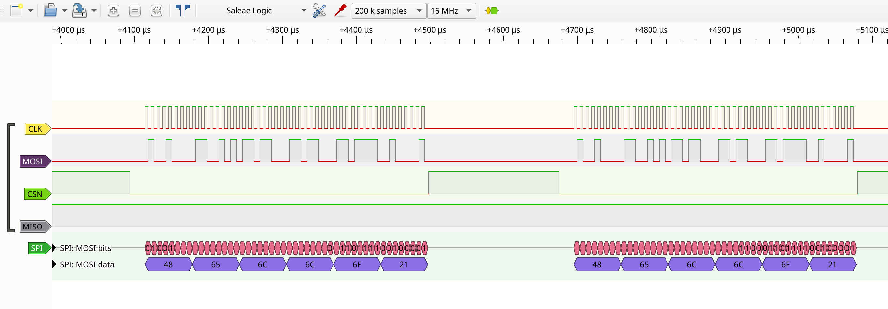
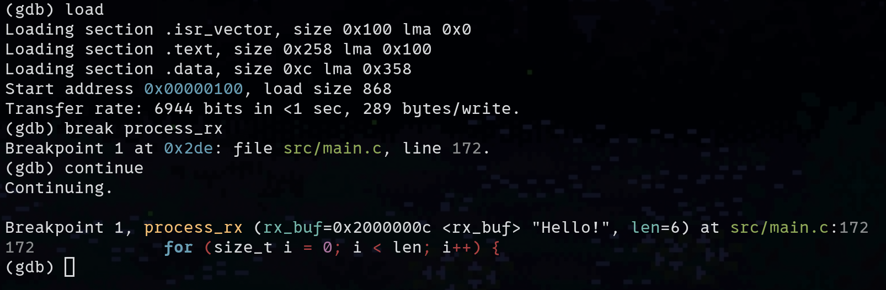

# Serial Peripheral Interface (SPI) - nRF52840 baremetal

This project demonstrates a SPI Master (SPIM0) implementation on the nRF52840-DK, written in
pure baremetal.

### Demo

- Logic analyzer (PulseView) to observe SCK, MOSI, MISO, and CS timing:
  
- GDB breakpoints to inspect RX buffer populated via EasyDMA (MOSI-MISO loopback):
  - Data sent on TX: `Hello!`
  - Data received on RX:
    

### Commands

- Build:
  ```shell
  make
  ```
- Clean:
  ```shell
  make clean
  ```
- Flash the firmware using [nrfjprog](https://www.nordicsemi.com/Products/Development-tools/nRF-Command-Line-Tools/)
  on the [nRF52840 DK](https://www.nordicsemi.com/Products/Development-hardware/nRF52840-DK)
  ```shell
  nrfjprog --recover
  nrfjprog --program build/spi.elf --chiperase --verify --reset
  ```
