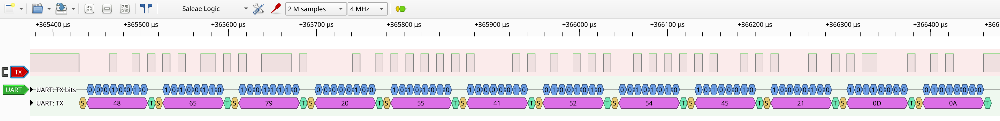
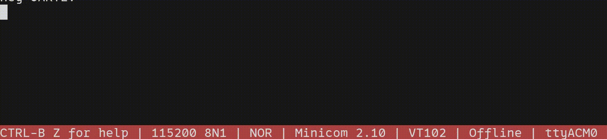

## Universal Asynchronous Receiver/Transmitter with EasyDMA (UARTE) — nRF52840 bare-metal (TX-only)

This project demonstrates a **TX-only UARTE (UART with EasyDMA)** implementation on the nRF52840-DK,
written in **pure bare-metal** (no SDK, no HAL, no Zephyr).

This is **not** a full UART driver.

## Demo

This shows **how UARTE works at the register and EasyDMA level** and how it can be used as a
**simple logging/debug output channel**.

- Logic analyzer (PulseView) to verify the TX signal on the UARTE TX pin (P0.06):
  
  > Data sent on TX: `Hey UARTE!\r\n` i.e., [0x48, 0x65, 0x79, 0x20, 0x55, 0x41, 0x52, 0x54, 0x45, 0x21, 0x0D, 0x0A]
- Serial terminal output (115200 8N1) from the nRF52840-DK's virtual COM port using minicom:
  
  ```shell
  minicom -D /dev/ttyACM0 -b 115200
  ```

### Commands

- Build:
  ```shell
  make
  ```
- Clean:
  ```shell
  make clean
  ```
- Flash the firmware using [nrfjprog](https://www.nordicsemi.com/Products/Development-tools/nRF-Command-Line-Tools/)
  on the [nRF52840 DK](https://www.nordicsemi.com/Products/Development-hardware/nRF52840-DK)
  ```shell
  nrfjprog --recover
  nrfjprog --program build/uarte.elf --chiperase --verify --reset
  ```
